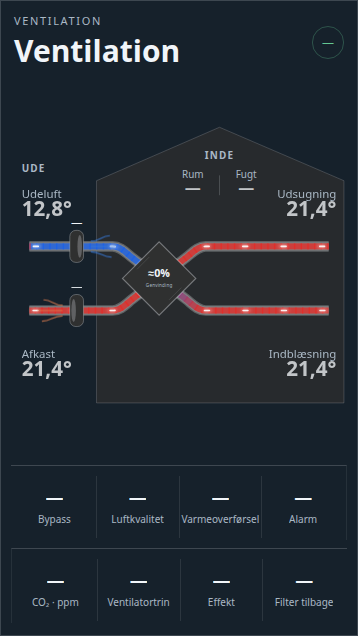

# Ventilation Card



A Home Assistant Lovelace card for a heat-recovery ventilation (HRV/ERV) unit. Vendor-neutral
— works with any set of matching sensors.

The card is a house-diagram layout: outdoor air enters on the left, passes through the heat
exchanger core, and supplies the house on the right; extract/exhaust air runs the opposite
way. Ducts animate only while the matching fan is actually running, colored along a shared
temperature gradient so the same measured temperature always reads the same color regardless
of which duct it's on. Bypass mode re-routes both ducts straight across, skipping the core.
Two side panels break out further metrics — bypass, air quality, heat transfer and alarm on
the left; CO₂, fan level, power and filter life on the right — and the house interior carries
a constant warm tint.

Plain JavaScript, no build step — copy the file in and register it as a dashboard resource.

## Installation

### HACS (custom repository)

1. In HACS, go to **Frontend** → the three-dot menu → **Custom repositories**.
2. Add `https://github.com/MRDonnii/ha-ventilation-card` as type **Dashboard**.
3. Install **HA Ventilation Card** and add the resource if HACS doesn't do it automatically.

### Manual

1. Download `ha-ventilation-card.js` from the latest release (or this repo).
2. Copy it to `config/www/community/ha-ventilation-card/ha-ventilation-card.js`.
3. Add it as a dashboard resource:
   ```yaml
   url: /local/community/ha-ventilation-card/ha-ventilation-card.js
   type: module
   ```

## Usage

Add the card via the dashboard editor (search for "Ventilation") or in YAML:

```yaml
type: custom:ha-ventilation-card
title: Ventilation
animation: true
show_afterheat: false
show_history: false
entities:
  outdoor_temperature: sensor.outdoor_temperature
  supply_temperature: sensor.supply_temperature
  extract_temperature: sensor.extract_temperature
  exhaust_temperature: sensor.exhaust_temperature
  afterheat_after: sensor.air_after_heating_coil
  supply_fan_rpm: sensor.supply_fan_speed
  extract_fan_rpm: sensor.extract_fan_speed
  supply_fan_percent: sensor.supply_fan_percent
  extract_fan_percent: sensor.extract_fan_percent
  room_temperature: sensor.room_temperature
  humidity: sensor.room_humidity
  co2: sensor.co2
  power: sensor.ventilation_power
  heat_recovery: sensor.heat_recovery_efficiency
  level: select.ventilation_level
  mode: select.ventilation_mode
  bypass: binary_sensor.bypass_open
  filter_days: sensor.filter_days_remaining
  air_quality: sensor.air_quality
  heat_transfer: sensor.heating_coil_power
  alarm: binary_sensor.ventilation_alarm
  afterheat_active: binary_sensor.heating_coil_active
  water_flow: sensor.heating_coil_flow_temperature
  water_return: sensor.heating_coil_return_temperature
  water_delta: sensor.heating_coil_delta
```

All `entities` keys are optional — any duct, label, or metric whose entity isn't configured
simply renders as `—`. If `water_delta` isn't set, it's calculated automatically from
`water_flow` minus `water_return` where both are available.

## Dantherm details card

Version 0.3.0 also includes `custom:ha-ventilation-details-card`, a compact companion card
for diagnostics and service data. It groups the existing entities into five stable internal
tabs: **Overview**, **Fans**, **Afterheat**, **System**, and **History**. History uses two
embedded `mini-graph-card` instances, and filter reset always asks for confirmation first.

```yaml
type: custom:ha-ventilation-details-card
title: Dantherm details
entities:
  house_temperature: sensor.house_temperature
  heat_recovery_status: sensor.heat_recovery_status
  extract_control: sensor.extract_fan_control
  supply_control: sensor.supply_fan_control
  extract_speed: sensor.extract_fan_speed
  supply_speed: sensor.supply_fan_speed
  afterheat_setpoint: sensor.after_heater_setpoint
  air_before_coil: sensor.air_before_heating_coil
  air_after_coil: sensor.air_after_heating_coil
  water_flow: sensor.heating_coil_flow_temperature
  water_return: sensor.heating_coil_return_temperature
  hac1_connection: binary_sensor.hac1_connection
  rs485_traffic: binary_sensor.rs485_bus_traffic
  rs485_frames: sensor.rs485_frames_per_minute
  filter_reset: button.reset_filter_interval
```

All detail-card entity keys are optional. Missing values remain visible as `—`, so one card
configuration can be reused across Dantherm installations with different sensor coverage.

## Configuration reference

| Key | Description |
|---|---|
| `title` | Card header text (default `Ventilation`) |
| `animation` | Toggle the animated airflow (default `true`) |
| `show_afterheat` | Toggle the electric/water heating-coil panel on the supply duct (default `false`) |
| `show_history` | Embed temperature, CO₂ and heat-recovery graphs in the main card (default `false`) |
| `entities.outdoor_temperature` / `supply_temperature` / `extract_temperature` / `exhaust_temperature` | The four airflow temperatures |
| `entities.afterheat_after` | Air temperature measured downstream of the heating coil; used as the displayed supply temperature when `show_afterheat` is on and bypass is off |
| `entities.supply_fan_rpm` / `extract_fan_rpm` | Fan speed in RPM — drives duct animation and running state |
| `entities.supply_fan_percent` / `extract_fan_percent` | Fan speed as a percentage, shown above each fan icon |
| `entities.room_temperature` / `humidity` | Indoor climate readout |
| `entities.co2` / `power` / `heat_recovery` / `level` | Right-panel metrics: CO₂, power draw, recovery efficiency %, fan level |
| `entities.mode` | Operating mode text shown in the header chip |
| `entities.bypass` | Bypass state — re-routes both ducts and disables the core when open |
| `entities.filter_days` | Days remaining until filter change |
| `entities.air_quality` / `heat_transfer` / `alarm` | Left-panel metrics: air quality, heating coil power, alarm state |
| `entities.afterheat_active` / `water_flow` / `water_return` / `water_delta` | Electric/water heating-coil panel, shown when `show_afterheat` is on |

## License

MIT — see [LICENSE](LICENSE).
